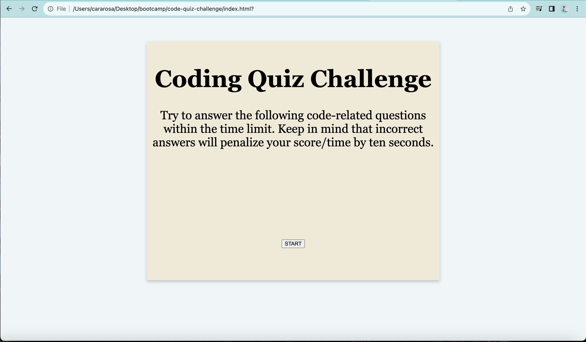

# Code Quiz Webpage

## Description

The Code Quiz Webpage allows for a user to test their knowledge on JavaScript. The user begins the quiz by clicking on the start button. After the user clicks this button, a timer starts and the first question is presented to the user. After the user selects one option out of the three options given, a message on the webpage appears telling the user if they got the answer correct or incorrect. After these occurences, the next question is presented to the user. The cycle continues until the last question. At the end of the quiz, the user is directed to the end page. At this page, the user can see the score and enter in his initials. After entering the initials, the user is directed to another screen listing the initials and the high score. The user now has the option to start the quiz over again or clear the high scores.

The Code Quiz Challenge highlights the use of JavaScript. Utilizing JavaScript (such as functions, for loops, and if loops). This project challenges students to logically put together the code needed to complete this challenge

## Installation

No installation is necessary. The link to the webpage is here:
[Code Quiz Webpage](https://cararosa.github.io/code-quiz-challenge/).

Below is a screenshot of the Code Quiz Webpage:

## Credits

I used StackOverflow to help set up the timer and allow the timer to start after the user pushes the start button. This code can be found in the index.html file and the script.js file in the folder assets and the subfolder js. My tutor was able to help me with logically coding how to tell the user if the right answer or the wrong answer was chosen. This code can be found in the script.js file. The AskBCS helped me in with an if statement for incrementing the index. This code can be found in script.js. My instructor was able to assist me with the code needed for moving to the next question after the user clicked on a response. This code can be found in the script.js file. He also helped in the code for decremening the time when the user chose an incorrect response.

## License

An MIT License has been used for this website. Please refer to the code-quiz-challenge repository for further details about the MIT License.
